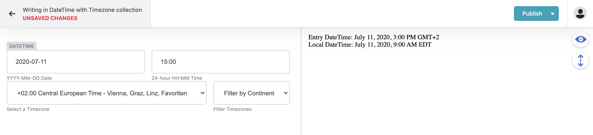

# Netlify CMS Widget DateTimeZone

[](https://github.com/jamfire/jamfire/packages/netlify-cms-widget-datetimezone/blob/master/LICENSE) [](https://www.npmjs.com/package/gatsby-theme-jamfire-conference)

This widget provides the `datetimezone` widget to store date, time, and timezone data for working with dates and times internationally. It was developed for [conference.jamfire.io](https://conference.jamfire.io) and was designed to use with [Luxon](https://moment.github.io/luxon/).



## Install

Add the package to your project.

```bash
yarn add netlify-cms-widget-datetimezone
```

Configure Netlify CMS to use the widget.

```js
// import libs
import CMS, { init } from "netlify-cms-app";
import {
	DateTimeZoneControl,
	DateTimeZonePreview,
} from "netlify-cms-widget-datetimezone";

// register datetimezone widget
CMS.registerWidget("datetimezone", DateTimeZoneControl, DateTimeZonePreview);
```

Add the widget to a field.

```yaml
fields:
  - { name: "datetimezone", label: "Start Time", widget: "datetimezone" }
```

## Example Component

```js
// import libs
import React from 'react';
import { DateTime } from "luxon";

/**
 * DateComponent
 * @param {string} datetime
 * @param {string} timezone
 * @param {string} locale
 */
const DateComponent = ({ datetime, timezone, locale }) => {

  // get the entry datetime and timezone
  const datetimeOriginal = DateTime
    .fromISO(datetime, { zone: timezone })

  // display datetime as a local date to your visitors
  const datetimeLocal = DateTime
    .fromISO(datetime, {
      zone: Intl.DateTimeFormat().resolvedOptions().timeZone
    })

  // display datetime in an i18n localized format
  const datetimeLocalized = DateTime
    .fromISO(dateTime, {
      zone: { zone: timezone }
    })
    .setLocale(locale))

  return(
    <p>
      Entry DateTime: {datetime.toLocaleString(DateTime.DATETIME_FULL)}<br />
      Local DateTime: {datetimeLocal.toLocaleString(DateTime.DATETIME_FULL)}<br />
      Localized DateTime: {datetimeLocalized.toLocaleString(DateTime.DATETIME_FULL)}
    </p>
  )
}
```

## Changelog

See [CHANGELOG.md](CHANGELOG.md)

## Contributing

See [CONTRIBUTING.md](CONTRIBUTING.md)
